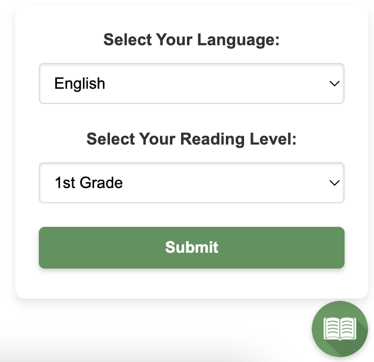
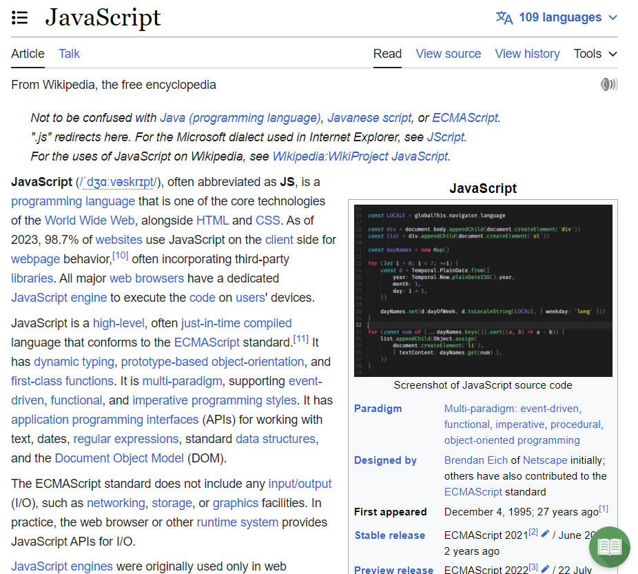
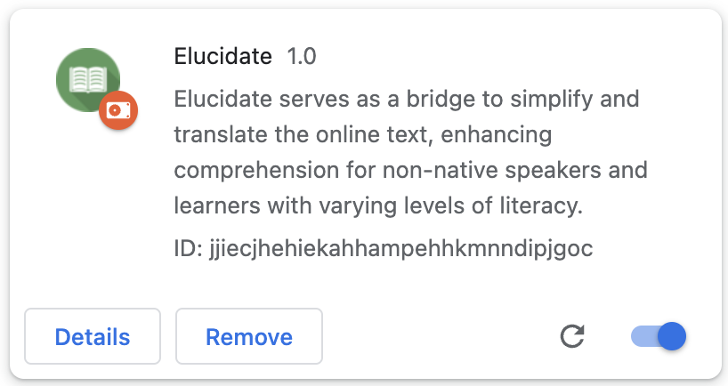
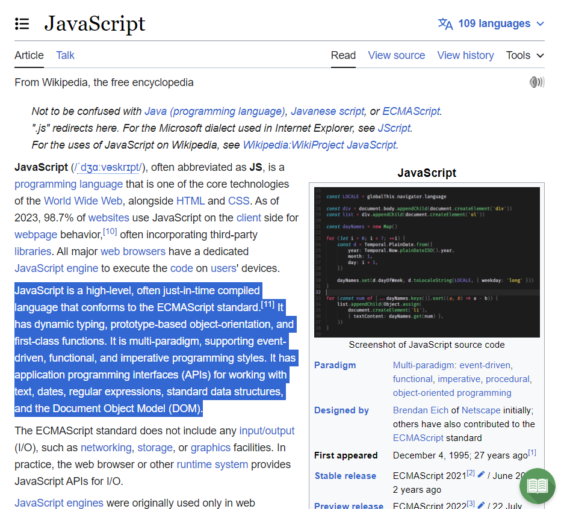
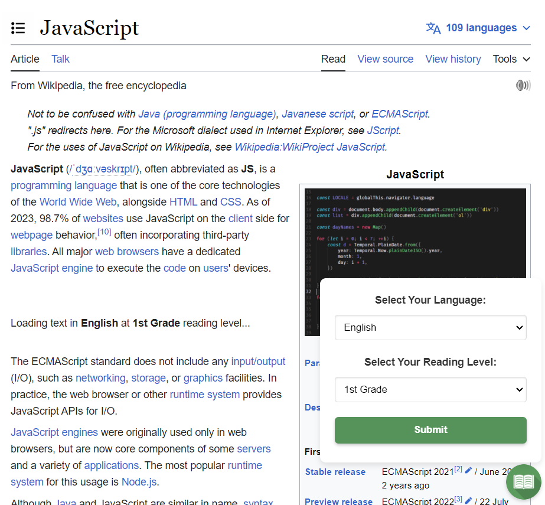
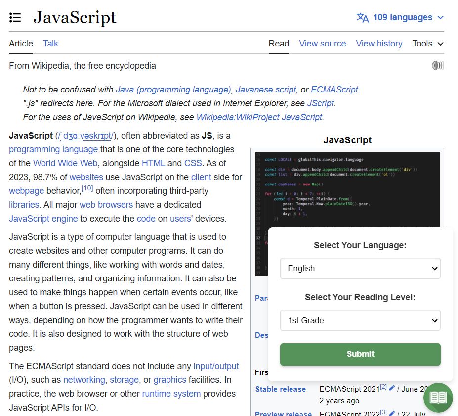
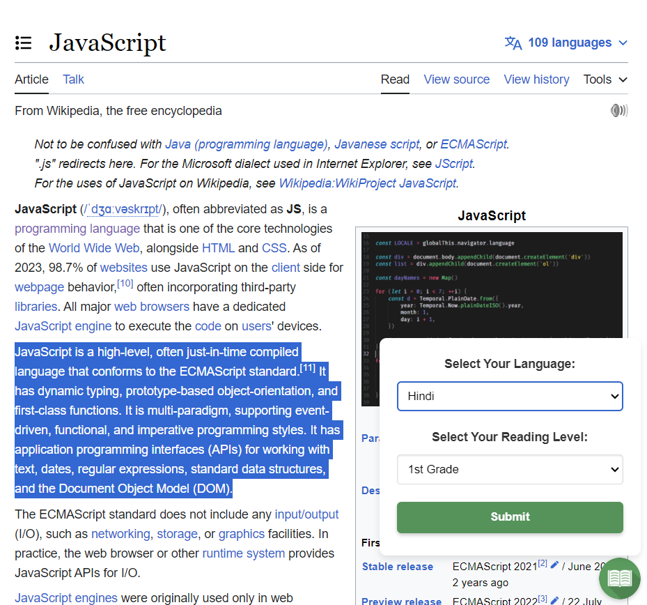
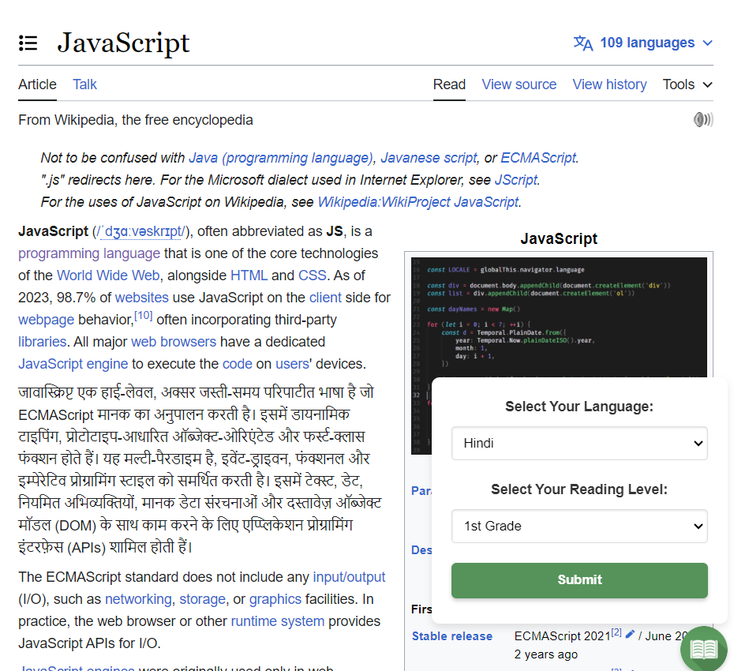

# Duke-Generative-AI-Hackathon: Elucidate Chrome Extension

## Introduction
**Elucidate** is an innovative AI-powered Chrome Extension designed to make the web more accessible for everyone. With over a billion individuals facing literacy challenges, Elucidate serves as a bridge to simplify and translate the online text, breaking down language barriers and enhancing comprehension for non-native speakers and learners with varying levels of literacy.



## Features
Elucidate empowers users by providing the following capabilities:
- **Adaptable Reading Levels:** Dynamically adjusts the complexity of selected text to match the user's reading proficiency.
- **Translation with Ease:** Translates selected text into a different language, tailored to the desired reading level.
- **User-Friendly Interface:** Intuitive design allows for effortless text modification and language translation.

## Installation
Waiting for the extension to be packed on Chrome Web Store
**To install Elucidate:**
1. Clone the repository from GitHub:
   ```sh
   git clone https://github.com/evanglas/Duke-Generative-AI-Hackathon.git
   ```
   Note: You have to replace the **API_KEY** in **popup.js** with your own private key from Open AI.
2. Navigate to `chrome://extensions/` in your Chrome browser.
3. Enable Developer Mode.
4. Click "Load unpacked" and select the directory where you cloned Elucidate.

## Usage
After installation, you can follow these steps to use Elucidate:
1. Enable your Elucidate Chrome Extension in your Extension webpage and pin this extension as you need.

2. Open any webpage and simply highlight any text on the webpage.

3. Click the Elucidate icon located on the bottom right corner of the webpage.

4. Choose your desired reading level and/or language translation.
5. Within seconds (depending on the length of text you select), the text will be transformed right before your eyes!





## Challenges We Faced
- Selecting the optimal model for API requests to balance accuracy and response time.
- Navigating the complexities of Chrome's extension environment and scripting contexts with replacing back to the orignal place.

## Accomplishments
- Developed a functional and valuable tool for language learners and individuals with varying literacy levels and language backgrounds.
- Successfully integrated the OpenAI API within a Chrome Extension.

## What We Learned
- The ins and outs of building a Chrome Extension from scratch.
- Practical application and integration of the OpenAI API into web tools.

## What's Next for Elucidate
- Exploring the potential for Chrome Web Store publication with a well-designed website besides the current popup interface.
- Enhancing functionality to support more languages and precise reading levels.
- Investigating the feasibility of translating entire web pages.

## Built With
- [Chrome Developer API](https://developer.chrome.com/docs/extensions/)
- [OpenAI GPT-3.5](https://beta.openai.com/)
- HTML
- CSS
- JavaScript

## Hackathon
Check out [Devpost Hackathon](https://devpost.com/software/elucidate-ycvbs5?ref_content=user-portfolio&ref_feature=in_progress) to learn more about our Hackathon process.
